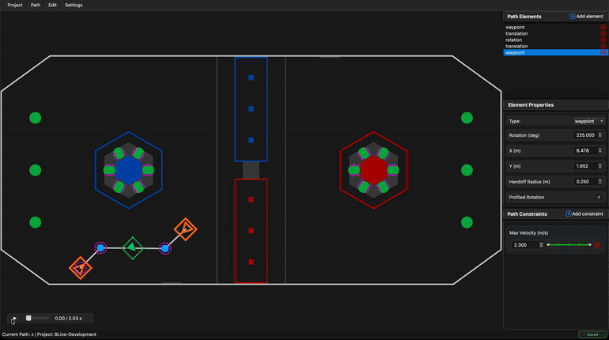

# BLine-GUI

**BLine** is an open-source path generation and tracking suite designed for **holonomic drivetrains** (swerve, mecanum, etc.). It's built around simplicity and performance in time-constrained environments where quick iteration and rapid empirical testing prove advantageous.

Built in-house by FRC Team 2638 Rebel Robotics, by students for students, with development beginning in late June of 2025, BLine plays into the recent emergence of the FRC polyline path planning meta, with renowned teams such as 2056 and 2910 (among others) running their own solutions during the 2025 Reefscape game.

☕ **[BLine-Lib](https://github.com/edanliahovetsky/BLine-Lib)** — the BLine Java library.

💬 **[Chief Delphi Thread](https://www.chiefdelphi.com/t/introducing-bline-a-new-rapid-polyline-autonomous-path-planning-suite/509778)** — discussion, feedback, and announcements.




## Table of Contents

- [Installation](#installation)
- [Quick Start](#quick-start)
- [Core Concepts](#core-concepts)
  - [Path Elements](#path-elements)
  - [Path Constraints](#path-constraints)
  - [Ranged Constraints](#ranged-constraints)
- [GUI Overview](#gui-overview)
  - [Canvas](#canvas)
  - [Sidebar](#sidebar)
  - [Simulation](#simulation)
- [JSON Path Format](#json-path-format)
- [Usage](#usage)
- [Usage Tips](#usage-tips)
- [Development](#development)
- [License](#license)

## Installation

### Prebuilt Binaries (Recommended)

Download the latest release for your platform from the [**Releases page**](https://github.com/edanliahovetsky/BLine-GUI/releases/latest).

#### Windows

Choose one of the following:

**Installer (Recommended)**
1. Download `BLine-{version}-Setup.exe`
2. Run the installer and follow the wizard
3. Launch BLine from the Start Menu

**Portable (No Installation)**
1. Download `BLine-{version}-Windows-Portable.zip`
2. Extract anywhere
3. Run `BLine.exe`

No Python installation required—everything is bundled!

#### Linux

**AppImage (All Distributions)**
1. Download `BLine-x86_64.AppImage`
2. Make it executable:
   ```bash
   chmod +x BLine-x86_64.AppImage
   ```
3. Run it:
   ```bash
   ./BLine-x86_64.AppImage
   ```

No installation or dependencies required!

#### macOS

macOS builds are not currently available as prebuilt binaries. See [Install from Source](#install-from-source) below.

---

### Install from Source

If you prefer to install via Python package or need the latest development version:

**Quick Install (all platforms):**
```bash
pipx install git+https://github.com/edanliahovetsky/BLine-GUI.git
```

Then run `bline` from anywhere. Don't have pipx? See platform-specific instructions below.

<details>
<summary><strong>Windows</strong></summary>

#### Using pipx (Recommended)

```powershell
# Install pipx (one-time setup)
pip install pipx
pipx ensurepath

# Restart your terminal, then install BLine
pipx install git+https://github.com/edanliahovetsky/BLine-GUI.git
```

**Troubleshooting:** If you get a PySide6 build error, install Python 3.11 or 3.12 from [python.org](https://www.python.org/downloads/windows/) and specify it:

```powershell
py -3.12 -m pip install --upgrade pip pipx
py -3.12 -m pipx ensurepath
py -3.12 -m pipx install git+https://github.com/edanliahovetsky/BLine-GUI.git
```

#### Using pip

```powershell
# Create a folder for BLine
mkdir %USERPROFILE%\BLine
cd %USERPROFILE%\BLine

# Create a virtual environment and install
python -m venv .venv
.venv\Scripts\activate
pip install git+https://github.com/edanliahovetsky/BLine-GUI.git

# Run BLine
bline
```

</details>

<details>
<summary><strong>macOS</strong></summary>

#### Using Homebrew (Recommended)

```bash
# Install Homebrew if needed
/bin/bash -c "$(curl -fsSL https://raw.githubusercontent.com/Homebrew/install/HEAD/install.sh)"

# Install pipx and BLine
brew install pipx
pipx ensurepath
pipx install git+https://github.com/edanliahovetsky/BLine-GUI.git
```

#### Using pip

```bash
# Create a folder for BLine
mkdir -p ~/Applications/BLine
cd ~/Applications/BLine

# Create a virtual environment and install
python3 -m venv .venv
source .venv/bin/activate
pip install git+https://github.com/edanliahovetsky/BLine-GUI.git

# Run BLine
bline
```

</details>

<details>
<summary><strong>Linux</strong></summary>

#### Using pipx (Recommended)

```bash
# Install pipx
# Debian/Ubuntu:
sudo apt install pipx

# Fedora:
sudo dnf install pipx

# Arch:
sudo pacman -S python-pipx

# Install BLine
pipx ensurepath
pipx install git+https://github.com/edanliahovetsky/BLine-GUI.git
```

**Troubleshooting:** If you get a PySide6 build error, specify Python 3.11 or 3.12:

```bash
pipx install --python python3.12 git+https://github.com/edanliahovetsky/BLine-GUI.git
```

#### Using pip

```bash
# Create a folder for BLine
mkdir -p ~/Applications/BLine
cd ~/Applications/BLine

# Create a virtual environment and install
python3 -m venv .venv
source .venv/bin/activate
pip install git+https://github.com/edanliahovetsky/BLine-GUI.git

# Run BLine
bline
```

</details>

## Quick Start

**Binary installation:** Launch BLine from your Start Menu (Windows), Applications folder, or run the executable directly.

**Python package installation:** Run `bline` from any terminal. To create a desktop shortcut with the BLine icon, run `bline --create-shortcut`.

## Core Concepts

BLine represents autonomous paths as sequences of **path elements**. Understanding these elements is essential for effective path planning.

### Path Elements

The GUI provides three element types that match the BLine-Lib data model:

| Element | Canvas Appearance | Description |
|---------|-------------------|-------------|
| **Waypoint** | Orange rectangle with rotation handle | Combined translation + rotation target. The robot drives to this position AND rotates to the specified heading. |
| **TranslationTarget** | Blue circle | Position-only target. The robot drives through this point without changing its rotation setpoint. |
| **RotationTarget** | Green dashed rectangle with rotation handle | Rotation-only target positioned along a segment. The robot rotates to this heading while traveling between anchors. |

#### Waypoints vs TranslationTargets

- Use **Waypoints** when the robot needs to face a specific direction at a location (e.g., scoring positions, intake stations)
- Use **TranslationTargets** for intermediate points where heading doesn't matter (e.g., avoiding obstacles, path shaping)

#### RotationTarget Positioning and Profiling

RotationTargets exist *between* anchors (Waypoints or TranslationTargets). The **t_ratio** parameter (0.0–1.0) determines where along the segment the rotation occurs:

- `t_ratio = 0.0` → Rotation at the start of the segment
- `t_ratio = 0.5` → Rotation at the midpoint
- `t_ratio = 1.0` → Rotation at the end of the segment

In the GUI, simply drag the RotationTarget along its connecting line to adjust the t_ratio visually.

**Profiled vs Non-Profiled Rotation:**

- **Profiled rotation** (default): The robot smoothly interpolates its heading based on its t-ratio progression along the path. As the robot travels between anchors, its rotation setpoint gradually transitions toward the target heading proportional to how far it has traveled along the segment.
- **Non-profiled rotation**: The robot immediately snaps to the target rotation when it enters the segment—no interpolation based on position.

Toggle this setting per-element in the sidebar under "Profiled Rotation".

### Key Parameters

#### Handoff Radius

Each translation element (Waypoint or TranslationTarget) has an **intermediate handoff radius**—the distance at which the path follower advances to the next target. On the canvas, this is visualized as a **magenta dashed circle** around the element.

- **Smaller radius** → Robot waits longer before switching targets. Better precision at waypoints, but can cause hesitation. If the radius is too small, the robot may overshoot and miss the handoff zone entirely—this is the worst case scenario and will cause erratic path behavior at high robot velocities.
- **Larger radius** → Robot switches sooner. Smoother transitions at speed, but may cut corners.

Set per-element radii in the sidebar, or configure a project-wide default in **Settings → Robot Config**.

### Path Constraints

Constraints limit robot velocity and acceleration to ensure controllable motion. The GUI supports both **global constraints** (applied to the entire path) and **ranged constraints** (applied to specific segments).

| Constraint | Unit | Description |
|------------|------|-------------|
| Max Velocity | m/s | Maximum translation speed |
| Max Acceleration | m/s² | Maximum translation acceleration |
| Max Rotational Velocity | deg/s | Maximum angular speed |
| Max Rotational Acceleration | deg/s² | Maximum angular acceleration |
| End Translation Tolerance | m | How close to final position to finish |
| End Rotation Tolerance | deg | How close to final heading to finish |

**Global constraints** are configured in **Settings → Robot Config**. These serve as defaults when no path-specific or ranged constraint is set.

### Ranged Constraints

Ranged constraints allow different limits for different path sections—essential for slowing down before tight turns or precision maneuvers.

Each ranged constraint specifies:
- **Value**: The constraint limit
- **Start Ordinal**: First element this applies to (1-based in the GUI)
- **End Ordinal**: Last element this applies to (inclusive)

**Important:** Translation and rotation constraints use separate ordinal counters:

- **Translation ordinals** count TranslationTarget and Waypoint elements
- **Rotation ordinals** count RotationTarget and Waypoint elements

#### Visualizing Ranged Constraints

When you click on a ranged constraint's slider, a **green overlay** highlights the affected path segments on the canvas. This shows exactly where the constraint will apply during path execution.

**Note on start ordinal behavior:** A ranged constraint that includes the starting element will affect all robot motion *leading into* that element. For example, if your robot doesn't begin at the first path element (e.g., it's placed mid-field), a velocity constraint starting at ordinal 1 will limit the robot's speed as it travels toward the first waypoint.

## GUI Overview

### Canvas

The canvas displays the field with your path overlaid. Key features:

- **Drag elements** to reposition them on the field
- **Drag rotation handles** (the small circles extending from Waypoints/RotationTargets) to adjust heading
- **Scroll wheel** to zoom in/out
- **Click and drag on empty space** to pan the view
- **Delete/Backspace** to remove selected elements

Element colors on canvas:
- 🟠 **Orange** → Waypoint (has both position and rotation)
- 🔵 **Blue** → TranslationTarget (position only)
- 🟢 **Green dashed** → RotationTarget (rotation only)
- 🟣 **Magenta dashed circle** → Handoff radius around translation elements

### Sidebar

The sidebar provides detailed editing of path elements and constraints:

**Path Elements Panel:**
- Lists all elements in path order
- Drag to reorder elements
- Click "Add element" to insert new elements after the selection
- Click the ✕ button to remove elements

**Element Properties Panel:**
- **Type** dropdown to convert between element types
- **Rotation (deg)** for Waypoints and RotationTargets
- **X/Y (m)** for position coordinates
- **Handoff Radius (m)** for translation elements
- **Profiled Rotation** checkbox for Waypoints and RotationTargets

**Path Constraints Panel:**
- Click "Add constraint" to add velocity/acceleration limits
- Use range sliders to specify which elements the constraint applies to
- Remove constraints with the ✕ button

### Simulation

The built-in simulation previews how your robot will follow the path.

Transport controls at the bottom-left of the canvas:
- **▶ / ⏸** Play/pause simulation (or press `Space`)
- **Slider** to scrub through the path timeline
- **Time display** showing current/total path duration

The orange trail shows the robot's simulated trajectory.

> ⚠️ **Simulation Limitations:** The simulation uses idealistic kinematics and assumes the drivetrain responds instantly to commanded velocities. It calculates desired speeds using a 2ad distance formula (v = √(2 × acceleration × remaining_distance)) rather than simulating the actual PID controller-based approach used by BLine-Lib on the robot. This provides an initial visualization of your path, but for more accurate results, use a physics simulation framework like WPILib's. Ultimately, **empirical testing is the final verdict on path success**—and rapid iteration is where BLine shines.

## JSON Path Format

Paths are stored as JSON files in your project's `paths/` directory. The format matches what BLine-Lib expects:

```json
{
  "path_elements": [
    {
      "type": "waypoint",
      "translation_target": {
        "x_meters": 1.5,
        "y_meters": 4.0,
        "intermediate_handoff_radius_meters": 0.25
      },
      "rotation_target": {
        "rotation_radians": 0.0,
        "profiled_rotation": true
      }
    },
    {
      "type": "translation",
      "x_meters": 3.0,
      "y_meters": 5.5,
      "intermediate_handoff_radius_meters": 0.3
    },
    {
      "type": "rotation",
      "rotation_radians": 1.57,
      "t_ratio": 0.5,
      "profiled_rotation": true
    },
    {
      "type": "waypoint",
      "translation_target": {
        "x_meters": 5.0,
        "y_meters": 4.0
      },
      "rotation_target": {
        "rotation_radians": 3.14,
        "profiled_rotation": true
      }
    }
  ],
  "constraints": {
    "max_velocity_meters_per_sec": [
      { "value": 4.0, "start_ordinal": 0, "end_ordinal": 1 },
      { "value": 2.0, "start_ordinal": 2, "end_ordinal": 2 }
    ],
    "max_acceleration_meters_per_sec2": 3.0,
    "end_translation_tolerance_meters": 0.05,
    "end_rotation_tolerance_deg": 2.0
  }
}
```

**Note:** The JSON uses 0-based ordinals while the GUI displays 1-based ordinals for user-friendliness.

## Usage

### Create a Desktop Shortcut

To create a desktop shortcut with the BLine icon:

```bash
bline --create-shortcut
```

This opens a dialog where you can choose to add shortcuts to your Desktop and/or Start Menu (Windows) / Applications folder (macOS/Linux).

### Updating

To update to the latest version:

```bash
# If you used pipx:
pipx upgrade bline

# If you used pip (with venv activated):
pip install --upgrade git+https://github.com/edanliahovetsky/BLine-GUI.git
```

**If `pipx upgrade bline` fails on Windows:** this can happen if pipx is pointing at a moved/updated Python install.
Try one of these:

```powershell
# Recreate the pipx venv for bline
pipx reinstall bline

# Or remove + install fresh
pipx uninstall bline
pipx install git+https://github.com/edanliahovetsky/BLine-GUI.git
```

### Uninstalling

```bash
# If you used pipx:
pipx uninstall bline

# If you used pip:
# Just delete the BLine folder you created
```

## Usage Tips

### Recommended Constraint: Max Translational Velocity

The max translational velocity constraint is the primary ranged constraint recommended for most use cases. It is the most effective method for counteracting overshoot at sharp turns—other than increasing the handoff radius, which reduces path precision. By limiting velocity before tight corners, the robot can decelerate in time and follow the intended path more accurately.

### PID Tuning at Maximum Velocities

When tuning the translation and rotation PID controllers, stress-test your controller gains at maximum robot velocity and acceleration for both translation and rotation.

> ⚠️ **Warning:** If you limit max acceleration after tuning your controllers, or increase max allowable velocity beyond what was used during tuning, you will likely experience:
> - Overshoot when reaching the path endpoint
> - Unexpected behavior during path following
>
> Always tune your controllers within the full operating range of velocities and accelerations that your path constraints allow.

### Single-Element Paths

Paths can consist of just one Waypoint or TranslationTarget—useful for simple point-to-point moves where you just need to drive to a single location. Note that a path with only a RotationTarget is invalid (you need at least one translation element).

## Development

For contributors who want to work on BLine itself:

### Requirements

- Python 3.11+
- PySide6 (installed automatically via `requirements.txt`)

### Setup

```bash
git clone https://github.com/edanliahovetsky/BLine-GUI.git
cd BLine-GUI
python -m venv .venv
source .venv/bin/activate  # On Windows: .venv\Scripts\activate
pip install -r requirements.txt
python main.py
```

Alternatively, run `./scripts/dev_env.sh` to create the virtualenv, install dependencies, and launch the GUI in one step.

### Development Workflow

Common tasks are provided via the `Makefile`:

| Command       | Description                         |
|---------------|-------------------------------------|
| `make install`| Install dependencies into `.venv`   |
| `make run`    | Launch the GUI                      |
| `make fmt`    | Run Black + Ruff formatting         |
| `make lint`   | Run Ruff and MyPy                   |
| `make test`   | Execute the pytest suite            |

### Project Layout

- `main.py` — Application entry point
- `models/` — Path data structures and simulation logic
- `ui/` — Qt widgets (canvas, sidebar, dialogs, main window)
- `utils/` — Project persistence, undo stack, helpers
- `example_project/` — Sample configs and paths for experimentation

### Tests & CI

Unit tests live under `tests/` and focus on the pure-Python logic in `models/` and `utils/`.
GitHub Actions runs `ruff`, `black --check`, `mypy`, and `pytest` on every push and pull request.

## License

BSD 3-Clause License — See [LICENSE](LICENSE) file.
